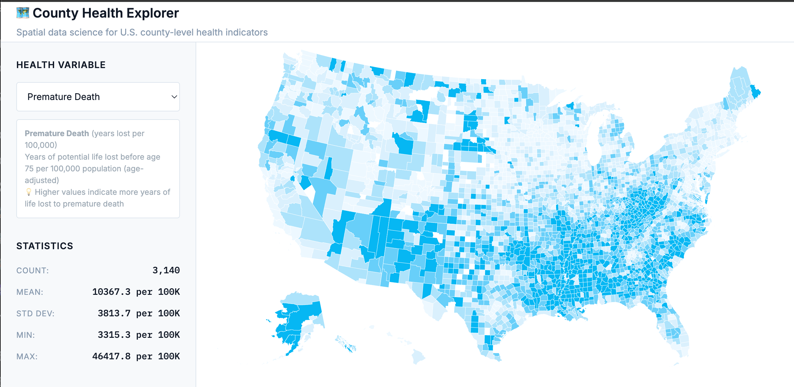

# 🗂️ County Health Explorer



A minimalist, reproducible, full-stack spatial data science application to explore U.S. county-level health data. This project showcases backend-to-frontend integration using DuckDB, FastAPI, and vanilla JavaScript with Observable Plot for cartographically accurate mapping and statistical charting.

**✅ Status**: Fully functional with working backend and frontend servers

## 🧱 Tech Stack

### Backend
- **Language**: Python 3.10+
- **Framework**: FastAPI
- **Database**: DuckDB (with spatial extension)
- **Spatial Libraries**: GeoPandas, PySAL

### Frontend
- **Language**: Vanilla JavaScript (ES6)
- **Mapping & Charts**: Observable Plot (UMD) with D3 projections
- **Projections**: Albers Equal Area for accurate spatial representation
- **UI**: Plain HTML/CSS (no frameworks)

## 📁 Project Structure

```
county-health-explorer/
├── backend/
│   ├── app/
│   │   ├── main.py              # FastAPI application
│   │   ├── database.py          # DuckDB setup with spatial extension
│   │   ├── etl.py              # Data extraction, transformation, loading
│   │   └── routes/
│   │       ├── api.py          # Core API endpoints
│   │       └── tiles.py        # Spatial tile endpoints
│   ├── templates/              # Jinja2 HTML templates
│   └── tests/                  # Test suite
├── frontend/
│   ├── css/                    # Vanilla CSS styles
│   ├── js/                     # Vanilla JavaScript modules
│   └── index.html              # Main application page
├── data/                       # Data files and DuckDB database
├── scripts/
│   ├── etl.sh                  # ETL pipeline script
│   └── dev.sh                  # Development setup script
└── README.md
```

## 🎯 Features

- **Cartographically Accurate Maps**: County-level choropleth maps with Albers Equal Area projection via Observable Plot
- **Dynamic Variable Selection**: Switch between health indicators via dropdown
- **Statistical Analysis**: Summary statistics, spatial autocorrelation (Moran's I), correlations
- **Real-time Charts**: Histograms and scatter plots with Observable Plot
- **Spatial Analysis**: County neighbors and local spatial statistics
- **Responsive Design**: Mobile-friendly interface with progressive enhancement
- **Performance**: Optimized spatial queries and SVG rendering

## 🚀 Quick Start

### Prerequisites
- Python 3.10+
- pip

### Installation

1. **Clone or navigate to the project directory**

2. **Install dependencies**:
   ```bash
   pip install -r requirements.txt
   ```

3. **Set up virtual environment**:
   ```bash
   python -m venv venv
   source venv/bin/activate  # On Windows: venv\Scripts\activate
   pip install -r requirements.txt
   ```

4. **Run ETL pipeline** (first time only):
   ```bash
   PYTHONPATH=backend python -m app.etl
   ```

### Development (Recommended)

**Start both servers individually**:

Terminal 1 - Backend server:
```bash
cd backend && ../venv/bin/python3 -m uvicorn app.main:app --reload --port 8000
```

Terminal 2 - Frontend server:
```bash
python serve_frontend.py
```

**Alternative**: Use the development script (may require debugging):
```bash
python start_dev.py
```

### Production

**Start the main application server**:
```bash
cd backend && uvicorn app.main:app --port 8000
```

### Access Points
- **🌐 Frontend Application**: http://localhost:3000
- **📚 API Documentation**: http://localhost:8000/docs  
- **🔍 Health Check**: http://localhost:8000/health
- **📊 Example API Call**: http://localhost:8000/api/stats?var=premature_death

## 🔗 API Endpoints

### Core Endpoints
- `GET /api/vars` - List available health variables and metadata
- `GET /api/variables/categories` - Variables grouped by health domain
- `GET /api/choropleth?var=<variable>` - GeoJSON with joined data and class breaks
- `GET /api/stats?var=<variable>` - Summary statistics (count, mean, std, min, max)
- `GET /api/moran?var=<variable>` - Moran's I spatial autocorrelation
- `GET /api/corr?vars=var1,var2` - Correlation between variables

### County-Specific
- `GET /api/counties/{fips}` - Individual county details
- `GET /api/neighbors/{fips}` - Spatial neighbors for local analysis

### Example API Responses

```json
// GET /api/stats?var=premature_death
{
  "variable": "premature_death",
  "count": 3142,
  "mean": 7605.2,
  "std": 1212.3,
  "min": 4321,
  "max": 10234
}

// GET /api/choropleth?var=obesity
{
  "type": "FeatureCollection",
  "features": [
    {
      "type": "Feature",
      "properties": {"fips": "08031", "value": 24.3, "class": 5},
      "geometry": { ... }
    }
  ]
}
```

## 🏗️ Development

### Architecture
The application uses a simple but powerful architecture:
- **DuckDB** with spatial extension for fast analytical queries
- **FastAPI** for RESTful API with automatic OpenAPI documentation
- **Jinja2** for server-side HTML templating
- **Vanilla JavaScript** with ES6 modules for frontend interactions
- **Observable Plot** for cartographically accurate mapping with proper projections
- **Observable Plot** for statistical visualizations (histograms, scatter plots)

### State Management
Frontend uses a central `AppState` object:

```javascript
const AppState = {
  currentVariable: 'premature_death',
  selectedCounty: null,
  mapLoaded: false,
  projection: 'albers-usa' // Albers Equal Area projection
};
```

### ETL Pipeline
- Loads `county_health.csv` into DuckDB
- Normalizes column names
- Joins county GeoJSON via `fips_code`
- Creates spatial WKB views
- Validates output (3142 counties, data integrity)

## 📊 Data Sources

This application utilizes data from the following authoritative sources:

### Health Data
- **County Health Rankings & Roadmaps**: [https://www.countyhealthrankings.org/](https://www.countyhealthrankings.org/)
  - Provides comprehensive county-level health indicators including health outcomes, health factors, and social determinants
  - 2025 Annual Data Release with measures for all U.S. counties
  - Data includes premature death rates, preventable hospital stays, health behaviors, clinical care access, and social & economic factors

### Geographic Data
- **U.S. Census Bureau Cartographic Boundary Files**: [https://www.census.gov/geographies/mapping-files/time-series/geo/carto-boundary-file.html](https://www.census.gov/geographies/mapping-files/time-series/geo/carto-boundary-file.html)
  - County boundary shapefiles optimized for thematic mapping
  - 1:500,000 scale resolution for detailed visualization
  - Simplified representations from the Census Bureau's MAF/TIGER geographic database

## 🎨 Design Principles

- **Minimalist**: No external JS frameworks or build tools
- **Reproducible**: Fixed seeds and idempotent ETL
- **Progressive**: Graceful degradation without JavaScript
- **Cartographically Accurate**: Albers Equal Area projection for proper spatial representation
- **Performant**: Optimized spatial queries and efficient SVG rendering
- **Accessible**: Mobile-friendly with accessible color palettes

## 🧪 Testing

Run the test suite:
```bash
python -m pytest backend/tests/
```

## 📈 Performance Metrics

- **Time-to-First-Map**: <2s
- **API Latency**: <150ms
- **DuckDB File Size**: <50MB
- **Codebase**: <2,000 LOC

## 🤝 Contributing

This project is designed for agentic development and reproducible science. Contributions should maintain:
- Zero external JS frameworks
- Minimal dependencies
- Full test coverage for core logic
- API documentation via OpenAPI

## 📄 License

MIT License

---

> "Simplicity is an antidote to confusion; when the mind is clear, action is precise."

Built for **public-serving clarity** and **repeatable science**. 